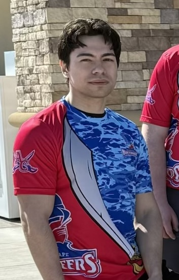
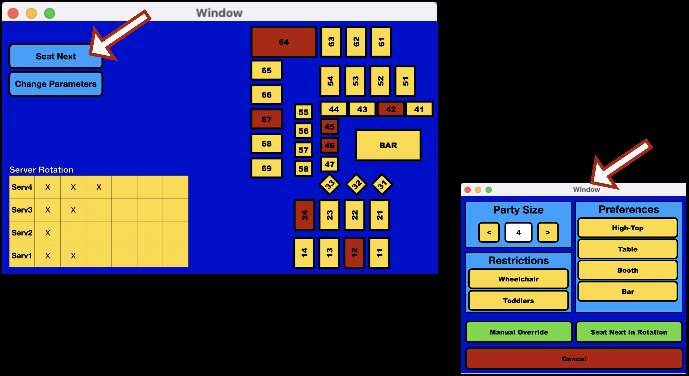

# Welcome
I’m a Computer Programming student focused on building practical software and real-world systems. This portfolio showcases my coursework and projects as I prepare to transfer and pursue advanced development work.

## About Me
- Currently pursuing an A.S. in Computer Programming  
- Experience with C++, Java, SQL, Visual Basic, and Swift (iOS)  
- Interested in software engineering, system design, and AI-related projects  
- Goal: to build advanced systems that solve real-world problems

- Strong foundation in C++ (control structures, functions, arrays, pointers, OOP)
- Strong foundation in Java (OOP, inheritance, basic data structures)

# Coursework

## Numbers converter
This program, written in C++, spells out any integer (up to 4 digits).

# Personal Projects
## beSeated (prototype / in development)
"beSeated" is a Java application that assists restaurant hosts in seating customers based on table size, server rotation, section load, table availability, and customer preferences or exceptions such as large parties or requested seating. It is based on my experience at Applebee’s, where hosts have to make quick seating decisions while balancing fairness for servers, efficient table usage, and guest satisfaction.

The program would keep track of restaurant sections, tables, and their attributes, such as seating capacity and tags like booth, high-top, wheelchair accessible, or movable. It would also account for which servers are working, how many tables or guests they currently have, and help recommend the best seating option for a new party. The overall goal is to make the seating process faster, more organized, and more consistent than relying only on memory or judgment in the moment.

(Work in progress)

* Load table data from a JSON file (tableID, seats, tags like booth, high-top, accessibility)
* Automatically group tables into sections based on tableID
* Track current restaurant state (available/occupied tables, active servers, section load)
* Input party details (size + preferences like booth or wheelchair access)
* Filter tables that fit the party size and required tags
* Apply basic server rotation and load balancing to choose fair seating
* Output best table options with a simple explanation (console → later UI)
* Use JavaFX to build a visual interface (floor view, table status, host controls)
* Allow hosts to select a recommended table, updating availability and rotation in real time

### 📂 Program Structure:

* Table.java – Table object (ID, seats, tags)
* TableType.java – Enum for table types (booth, high-top, etc.)
* TableTags.java – Enum for accommodations (wheelchair, toddler, etc.)
* Tester.java – Main class for testing and running the program
* tables.json – Stores table data (loaded into objects)
* libs/ – External libraries (e.g., Gson for JSON parsing)

## Concept UI

